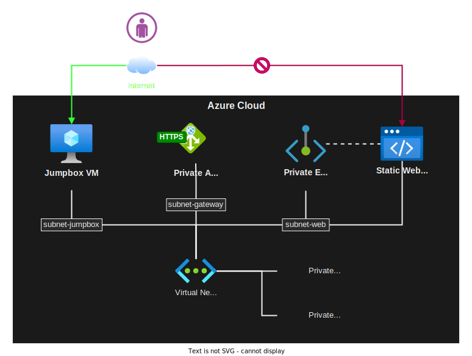

# Pulumi on Azure - Private Endpoints, Static Web

Private static web app accessible via Private Endpoints and blocked to the internet.



### Deployment

1 - Create the infrastructure with Pulumi:

```sh
npm install

az login
pulumi up -s dev -y
```

2 - Once the Static Web App is deployed, copy the deployment token `AZURE_STATIC_WEB_APPS_API_TOKEN` to GitHub as an Action secret. Triggering the pipeline will deploy the code to Azure.

3 - Site should be available via Private Endpoint - Use the Jumpbox VM for testing.

The Static Web Site will be available by it's public name, but routed internally by the Private DNS Zone. External access is blocked by the Azure Firewall. Detailed explanation [here](https://stackoverflow.com/a/69423659/3231778).